<!-- Animated profile header:
     Portrait:
       python scripts/prep_photo.py source-photo.jpg
       python scripts/make_ascii_svg.py

     Wordmark:
       $env:WORDMARK_FONT = "C:\Windows\Fonts\consola.ttf"
       $env:WORDMARK_FONT_INDEX = "0"
       $env:WORDMARK_TEXT = "PRATIK"
       python scripts/make_wordmark_svg.py --mode rock

     Contribution graph:
       python scripts/fetch_contributions.py
       python scripts/render_heatmap_svg.py
-->

<h3><code>pratik@github ~ $ whoami</code></h3>

<table>
<tr>
<td valign="top">
  
</td>
<td valign="top">
  
</td>
</tr>
</table>

 
 

<h3><code>pratik@github ~ $ ./contributions.sh</code></h3>

 
 

<h3><code>pratik@github ~ $ ./profile.sh</code></h3>

  <b>Salesforce DevOps Engineer · Release Manager · Automation Builder</b>

  Digital Solution Consultant — Senior Consultant at NTT DATA

  14× Salesforce Certified · 9× Copado Certified · Trailhead All-Star Ranger

 

<h3><code>pratik@github ~ $ cat stack.txt</code></h3>

  Salesforce · Copado · Azure DevOps · GitHub Actions · Python · AWS · Kubernetes

  CI/CD · Release Management · DevOps Automation · Cloud Infrastructure

 

<h3><code>pratik@github ~ $ ./links.sh</code></h3>

 

<h3><code>pratik@github ~ $ cat interests.txt</code></h3>

  Salesforce DevOps · Release Engineering · Web Scraping · AI Automation

  AWS · Kubernetes · Telegram Bots · GitHub Automation

 

